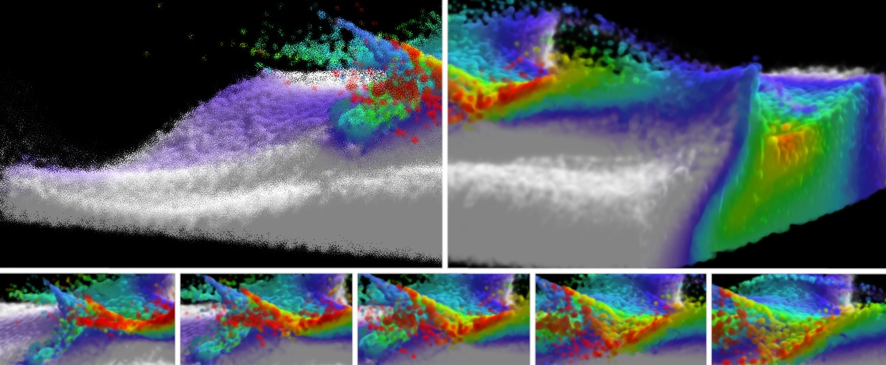

[](https://opensource.org/licenses/MIT)
[](https://github.com/gprt-org/GPRT/actions/workflows/ci.yml)

# GPRT (General Purpose Raytracing Toolkit)
GPRT is a ray tracing API that wraps the Vulkan ray tracing interface.



## Project Overview

The repository is organized into several key directories:

- **`gprt/`** – the core library. Host APIs are implemented in
  `gprt_host.h`/`gprt.cpp` while device-side shaders live in
  `gprt.slang`.  Math helpers are under `gprt/math/`.
- **`samples/`** – tutorial-style examples showing how to build ray
  tracing applications with GPRT.
- **`tests/`** – host-side tests for buffers and acceleration
  structures.
- **`docs/`** – Sphinx documentation sources.
- **`3rdParty/`** – external dependencies pulled in as submodules.

GPRT uses CMake to compile the host code and the Slang/HLSL toolchain
for device shaders. After buffers and programs are set up, the shader
binding table is built with `gprtBuildShaderBindingTable` before
launching work on the GPU.

## Dependencies

  - CMake
  - C++17
  - Vulkan SDK (>= 1.4.309.0)

## Documentation
GPRT's documentation can be found [here](https://gprt-org.github.io/GPRT/).

## Cloning
This repository contains submodules for external dependencies, so when doing a fresh clone you need to clone recursively:

```
git clone --recursive git@github.com:gprt-org/GPRT.git
```

Existing repositories can be updated manually:

```
git submodule init
git submodule update
```

## Build Instructions

Install the [Vulkan SDK](https://vulkan.lunarg.com/) for your platform (version 1.4.309.0 or greater).

GPRT uses CMake for configuration. For an empty directory, `build`, in the top
directory of this repository, the project can be configured with

```shell
cmake ..
```

and built with

```shell
cmake --build .
```

## Ubuntu Dependencies

The following apt-packages should be installed:

```shell
sudo apt install xorg-dev libxinerama-dev libglu1-mesa-dev freeglut3-dev mesa-common-dev libglfw3
```

along with the [Vulkan SDK](https://vulkan.lunarg.com/doc/view/latest/linux/getting_started_ubuntu.html).

Note: if using Ubuntu 22 with Wayland (or other distros for that matter), the above x11 dev packages still work via xwayland.

## Learning More

The [documentation](https://gprt-org.github.io/GPRT/) lists every host
and device API call. The samples are arranged as a progression of small
programs starting from `samples/s0-rayGenPrograms`; reading them is the
best way to become familiar with the API. The tests under `tests/`
provide additional usage examples for buffer and acceleration structure
operations.
