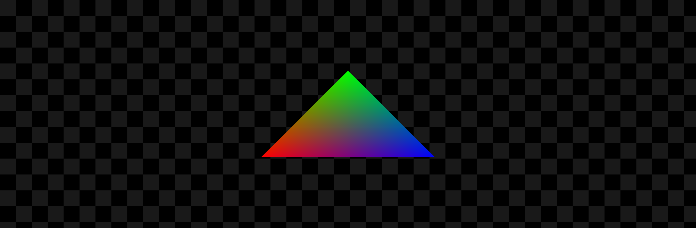
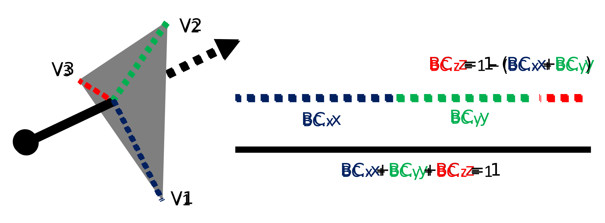
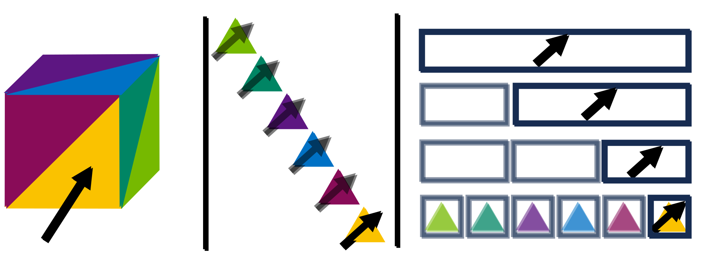
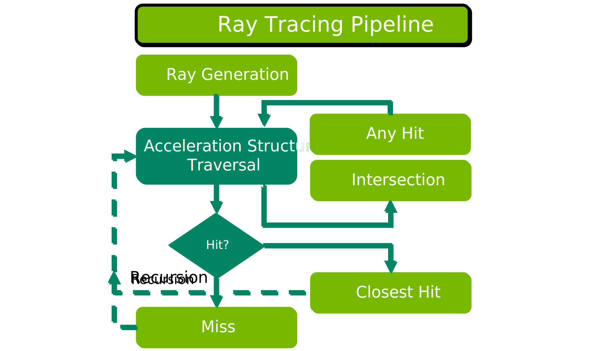

S01 Single Triangle
================================
`Corresponding sample code can be found here <https://github.com/gprt-org/GPRT/tree/master/samples/s01-singleTriangle>`_.

Introduction
------------

Objective of this Sample
^^^^^^^^^^^^^^^^^^^^^^^^

In this example, we'll build off the previous one and use GPRT to trace rays through the lens of a pinhole camera. 
Then, we'll test for intersection against a single "hello world triangle", coloring the triangle using "barycentric coordinates". 
To make this process faster and easier, we'll utilize the ray tracing (RT) cores in our ray tracing device.
Finally, we'll make this example interactive, allowing you to click and drag on the window to manipulate the camera viewing the triangle.

After running this example, you should see an image like this appear on your 
screen and be saved as s01-singleTriangle.png in the same directory as the sample's 
executable:

Background
----------

What is a Ray?
^^^^^^^^^^^^^^

   An illustration of the properties defining a ray. All rays have an origin, a direction, and a minimum and maximum hit distance.

Since the "RT" in GPRT stands for "ray tracing", it's worth talking about what exactly a ray is. 
In GPRT, rays are represented using the following structure:

.. code-block:: hlsl

  struct RayDesc
  {
      float3 Origin;
      float  TMin;
      float3 Direction;
      float  TMax;
  };

All rays have an origin, representing where the ray starts in 3D space. 
Then, rays have a direction, telling us what orientation in 3D space the ray is traveling.
We can use this definition of a ray to define a function where we give a distance *T* along the ray, and that function returns a position along that ray.

.. code-block:: hlsl

  float3 getPositionAlongRay(RayDesc ray, float T) 
  {
    return ray.Origin + T * ray.Direction;
  }
  
Rays also have a "TMin" and a "TMax". You can think of these properties as a minimum and a maximum distance "T" that a position can be along a ray.

.. code-block:: hlsl

  float3 getPositionAlongRay(RayDesc ray, float T) 
  {
    T = clamp(T, ray.TMin, ray.TMax); // this is new!
    return ray.Origin + T * ray.Direction;
  }

Ray Primitive Intersectors
^^^^^^^^^^^^^^^^^^^^^^^^^^

As these rays travel through the world, they will hit surfaces. 
The math for where these rays intersect surfaces can be a bit complicated, but fortunately our RT cores include a built-in ray-triangle intersector, so for now we'll be using that function.

.. code-block:: hlsl

  bool rayTriangleIntersect(RayDesc ray, Triangle triangle, out hitDistance, out barycentrics);

Ray intersector functions usually look something like the above. 
We give the function our ray, as well as the primitive (in our case, a triangle). 
The function returns True if the ray hits the primitive.
If the primitive is hit, the function also returns the hit distance *T*.

Finally, for triangle intersectors, we're given something called the "barycentric coordinates" of the intersection position.
These barycentric coordinates allow us to interpolate per-vertex data on our triangle primitive. 
For example, we might want to compute the position for where our ray hit our triangle: 

.. code-block:: hlsl

  float3 getHitPosition(float2 barycentrics, Triangle triangle) 
  {
    return   triangle.v1 * barycentrics.x
           + triangle.v2 * barycentrics.y
           + triangle.v3 * (-1.0 - (barycentrics.x + barycentrics.y);
  }
  
But those same barycentrics might be used to interpolate per-vertex colors, texture coordinates, surface normals, and so on.

   An illustration of barycentric coordinates (abreviated as "BC"). Barycentrics interpolate vertices, and describe the "weight of influence" of a vertex at the hit position. 
   RT cores reduce memory traffic by returning only two of the three barycentrics. All barycentrics sum to 1, and so the third barycentric can be solved by subtracting the sum of 
   the first two from 1.

Acceleration Structures
^^^^^^^^^^^^^^^^^^^^^^^

In a real-world application, 3D models are composed of many such triangles, so we not only want to know *if* our ray hit *a* triangle, but also *what* triangle our ray hit. 
This process also needs to be fast and perform well for really large meshes, so we want to test our ray against only a small subset of the triangles in our model.

To do this, ray tracing frameworks construct a hierarchy over the triangles---called an *Acceleration Structure*---in order to skip testing intersections against large collections of triangles that we know won't be hit. 
Each level in this hierarchy groups more and more triangles together into boxes, and if our ray does't hit the box, then we know our ray won't hit any of the triangles or sub-boxes inside.

   On the left, we have a cube made of triangles. 
   In the middle, we could test our ray against each triangle of the cube, but that would be expensive. 
   Instead, on the right we use acceleration structures to skip unnecessary intersection tests.

In GPRT, we use the real-time tree building features available in modern low level ray tracing frameworks. 
These features let you build these hierarchies on the GPU over hundreds of thousands of triangles in only a millisecond or two, so if your mesh animates over time, you don't need to worry about that slowing down your app. 

The Ray Tracing Pipeline
^^^^^^^^^^^^^^^^^^^^^^^^

When we trace a ray in GPRT, that ray traversal follows a process that we refer to as the "ray tracing pipeline". 

   An illustration of the ray tracing pipeline. Light green boxes indicate "programmable" stages, while dark green indicates fixed function hardware behavior that cannot be changed.

The whole ray tracing process is kicked off by a "ray generation" program, which--as the name suggests--generates a set of rays 
to trace into our scene. For example, these rays might all originate from a pinhole camera model.

As these rays are traced, they traverse through an acceleration structure. This traversal process is a "black box" process to us, and cannot be modified. However, because that process
occurs in ray tracing hardware, it is extremely fast. 

As rays hit triangles or custom primitive types, intersection and any hit programs are called. Intersection programs allow for custom primitive types, like spheres or curves. We can also 
choose to use hardware-accelerated intersectors that come built-in with our ray tracing cores. "Any hit" programs are an optional program which reports any primitives that intersect a ray, 
regardless of their closeness, and are useful for computing things like shadows where you might only care to find out if a ray hits "something", but don't care what that something is.

Eventually, the traversal process will either determine a final "closest hit" primitive, or determine that no primitives were hit at all. If a closest hit primitive is found,
then a corresponding "closest hit" program will be called. There, you might interpolate surface normals, texture colors, etc. Otherwise, a "miss" program will be called, where you instead might 
choose to determine a common background color, or some otherwise default miss behavior.

Rendering a Single Triangle
---------------------------

With the above background out of the way, in this example, we'll build a tree over just one triangle. 

Shared Code
^^^^^^^^^^^
To begin, we'll define some structures that will be shared between our host system
and our ray tracing device, which we'll declare in our *sharedCode.h* file. 

.. literalinclude:: ../../../samples/s01-singleTriangle/sharedCode.h
   :language: c++
   :lines: 23-52

Device Code
^^^^^^^^^^^
todo

Host Code
^^^^^^^^^

The first step is to create some buffers that define our geometry. 
The *vertices* represent the corners of the triangles that define our mesh in 3D space.
Then *indices* connect these vertices together. So here, since we only have one triangle, we will connect vertices 0, 1, and 2 together.

.. literalinclude:: ../../../samples/s01-singleTriangle/hostCode.cpp
   :language: c++
   :lines: 43-54

Then, we create a buffer on our ray tracing device, uploading this geometry data.

.. literalinclude:: ../../../samples/s01-singleTriangle/hostCode.cpp
   :language: c++
   :lines: 116-119

.. Then, this traversal process is handled for us by our RT cores. 
.. To make this traversal process fast, some parts of the traversal process are handled for us, and then other parts of this traversal process we have control over. 
.. This pipeline is called the Ray Tracing Pipeline.

.. I. Introduction 
.. A. Purpose of the example 
.. B. Overview of general-purpose ray tracing toolkit

.. II. Rendering a Single Triangle
.. A. Setting up the Scene 
.. 1. Create the triangle 
.. 2. Set the camera position 
.. 3. Set the materials 

.. B. Ray Tracing 
.. 1. Trace the rays 
.. 2. Calculate the color of each triangle 

.. C. Outputting the Result 
.. 1. Save the image 
.. 2. Display the image 

.. III. Conclusion 
.. A. Summary of the example 
.. B. Benefits of using the general-purpose ray tracing toolkit

.. I. Introduction 
.. A. Definition of Ray Tracing 
.. B. Overview of RTX Ray Tracing 

.. II. How RTX Ray Tracing Works 
.. A. Step 1: Primitive Assembly 
.. B. Step 2: Ray Generation 
.. C. Step 3: Ray Tracing 
.. D. Step 4: Shading 
.. E. Step 5: Rasterization 

.. III. Benefits of RTX Ray Tracing 
.. A. Improved Visual Quality 
.. B. Increased Performance 
.. C. Reduced CPU Load 

.. IV. Conclusion 
.. A. Summary of RTX Ray Tracing 
.. B. Benefits of Ray Tracing 
